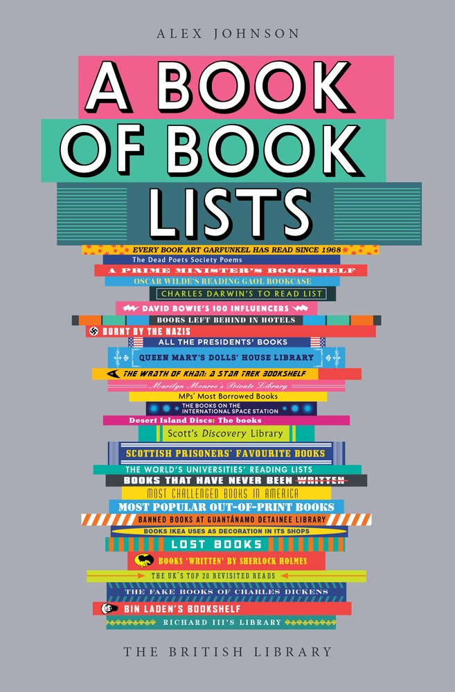

<h1></h1>

# Tic-Tak-Toe Project
> MIT xPRO - Week 17

This project was part of the course work required in the MIT xPRO Full-Stack development course taken.

## Description

A basic project to create a single page app with linking as well as incorporating React components.

### Features

* A listing of books with details from each respective book.
* Links that are navigated to by using single page application techniques.

## Installation

Clone the files that are in the Single-Page-App directory to your local machine.
A local server is needed to run the test React applications.
To do this complete the following steps:
- Download Live Server extension in VS code OR
- Download http-server via terminal using `npm install --global http-server` from https://www.npmjs.com/package/http-server
- Run a new terminal window within that folder and launch the React app via `http-server -c-1` 
- `-c-1` is used to stop the page from caching
- Once is it running, you can open your browser and navigate to the following site:
    - http://127.0.0.1:8080     
- To quit the application you can use `Ctrl + c`

### Expected outcomes:
A listing of books for easy access.

## Support

If by some unexpected circumstance the books stop booking, please get hold of me at gman.international@gmail.com and I will make it all right again.

## Roadmap of Future Improvements

- Same functionality but different data to be pulled.

## Versioning

Version 1.1.1

## License

Copyright (c) 2021 Gregory Shaw

Permission is hereby granted, free of charge, to any person obtaining a copy
of this software and associated documentation files (the "Software"), to deal
in the Software without restriction, including without limitation the rights
to use, copy, modify, merge, publish, distribute, sublicense, and/or sell
copies of the Software, and to permit persons to whom the Software is
furnished to do so, subject to the following conditions:

The above copyright notice and this permission notice shall be included in all
copies or substantial portions of the Software.

THE SOFTWARE IS PROVIDED "AS IS", WITHOUT WARRANTY OF ANY KIND, EXPRESS OR
IMPLIED, INCLUDING BUT NOT LIMITED TO THE WARRANTIES OF MERCHANTABILITY,
FITNESS FOR A PARTICULAR PURPOSE AND NONINFRINGEMENT. IN NO EVENT SHALL THE
AUTHORS OR COPYRIGHT HOLDERS BE LIABLE FOR ANY CLAIM, DAMAGES OR OTHER
LIABILITY, WHETHER IN AN ACTION OF CONTRACT, TORT OR OTHERWISE, ARISING FROM,
OUT OF OR IN CONNECTION WITH THE SOFTWARE OR THE USE OR OTHER DEALINGS IN THE
SOFTWARE.

## Team
* [Greg Shaw](https://github.com/greg4shaw)
